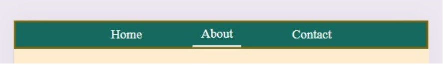
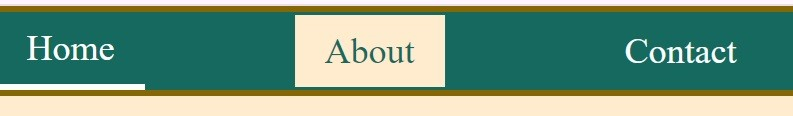
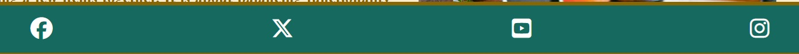
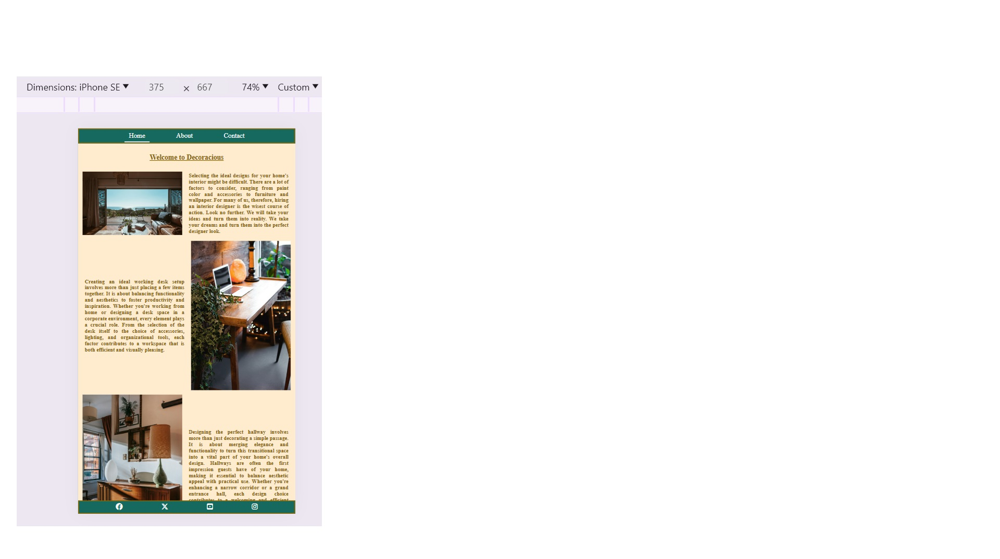
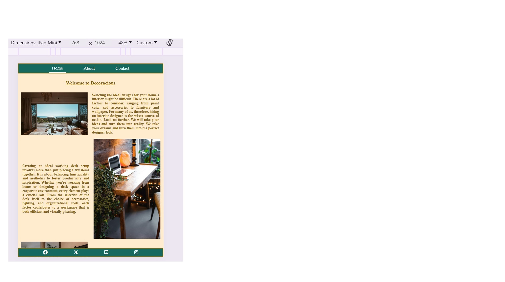
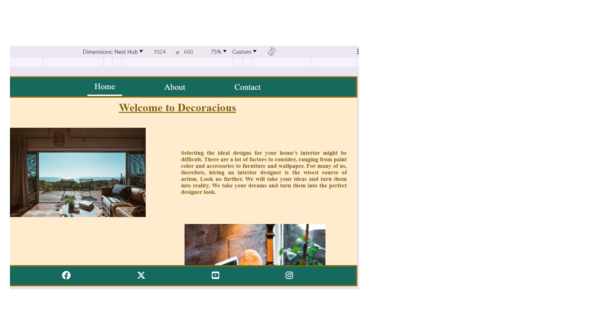
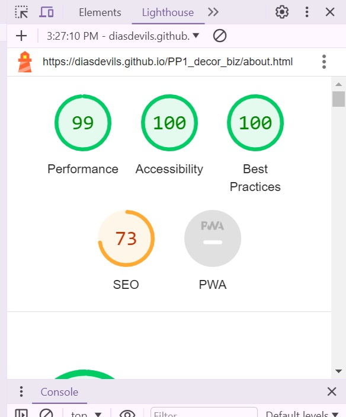
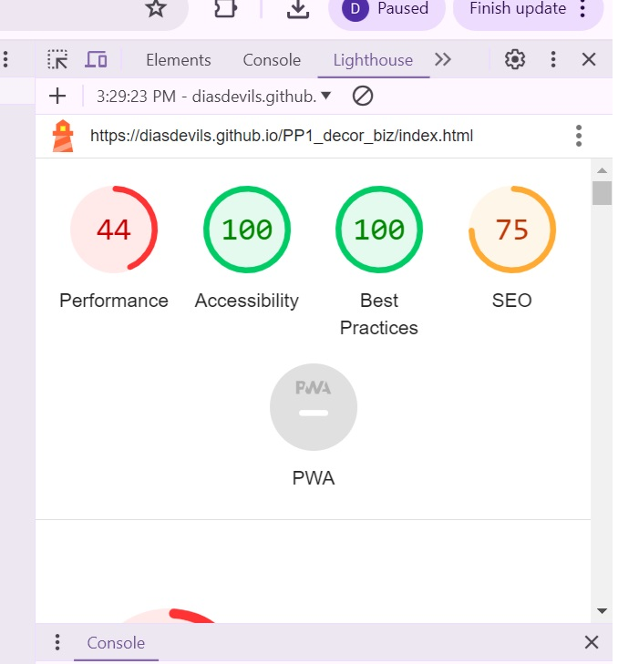
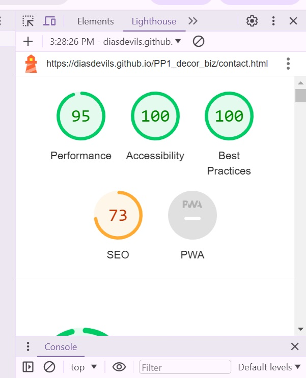

## First project PP1_decor_biz

# DECORATIOUS

The PP1 decor business named Decoracious is a website for a business which offers decoration/re-decoration in the home service.

Users will be able to see some of the examples of their work on the first "HOME" page. There are no prices because jobs vary, therefore this is not a detail to be included in the website. The site is targeted so that people know of the business existence rather than to shop.

# FEATURES

There are some features included in this site;

### 1- Navigational bar consisting of Home, About and Contact sections
The navigational bar has a hover over function which reverses the colours so it is easy to see they are on or about to click on the sections and they also have an underline to show they are on the page.

### 2- Social media network links at the bottom footer with thier icons for all the three pages.
Both the navigational and footer bars remain fixed during scrolling. All links open on a separate page.

### 3- The features show across all three pages. 
The landing home page, the about page and the contact pages. The home page shows straight away their previous decoration works. The about page reads the story of the company and the last page is the contact pages where is it easy to locate and call the company.

Overall the website is very easy to navigate. I did not include a toggle as some people may not know how to use the toggle and may not know they need to click on it. Thus, there are no hidden links to click behind toggles therefore the user does not have to figure out where to scroll or what to click to learn where to go.

## Photos of how the website looks on production Mobile size.

## Photos of how the webiste looks on Ipad size.

## Photos of how the website looks on website size.

# TESTING 
### Test One
I clicked each social media links manually to test they all open.
I also tested that all pages open upon clicking the navbar.

### Test Two
I used the validators for both HTML and CSS.
Sadly I lost the screenshots to show all the validation errors I had in the about html section and the my scc stylesheet. But I fixed and rechecked html.

I have validated once more to show the validation in SCC and since I did not fix all the erros in css the validation shows the errors again below.

### Test Three
And I have also tested for accessibility for all pages.

# BUGS
I had a lof of difficulties, especially with resizing for each device. I am aware that the website size home page does not look great in terms of size and could look better but I am not sure how to make it better for a more enjoyable viewer experience at this time.

I also saw a bug when resizing website. I am not sure if this is to do with an issue with browser or it is the responsiveness of the project itself.

I had struggled understanding concepts and working things out to the point that I had tried two other projects prior to this one.

### First I had tried applying the knowledge from the Love Running code
* from https://github.com/Code-Institute-Solutions/love-running-v3/
* for My music band project https://github.com/DiasDevils/Music_Band where photos are stretched on website ( not sure how to fix that)
### And secondly after the first attempt I tried code from Flex Demo
* from https://github.com/D0nni387/flex-demo 
* and applied to My Project https://diasdevils.github.io/Various_Business/

# REFERENCES AND CREDITS
I finally made this project taking code from all the sources named above.
I used the following:
* https://jigsaw.w3.org/css-validator/validator
* https://validator.w3.org/
* https://favicon.io/
* https://fontawesome.com/kits
* code Credit to ;
* 1- https://github.com/Code-Institute-Solutions/love-running-v3/
* 2- https://github.com/D0nni387/flex-demo 
* 3- My mentor Richard Wells for the help during mentoring sessions.

*Photos from Pexel.com with credits for the photos going to Heyho, Andreaedavis, Charlotte May, Ben Mack, Falling4utah, Jonathan Borba, Ksenia Chernaya, Oktay Koseoglu, Orlov Maria, Skylar Kang.

