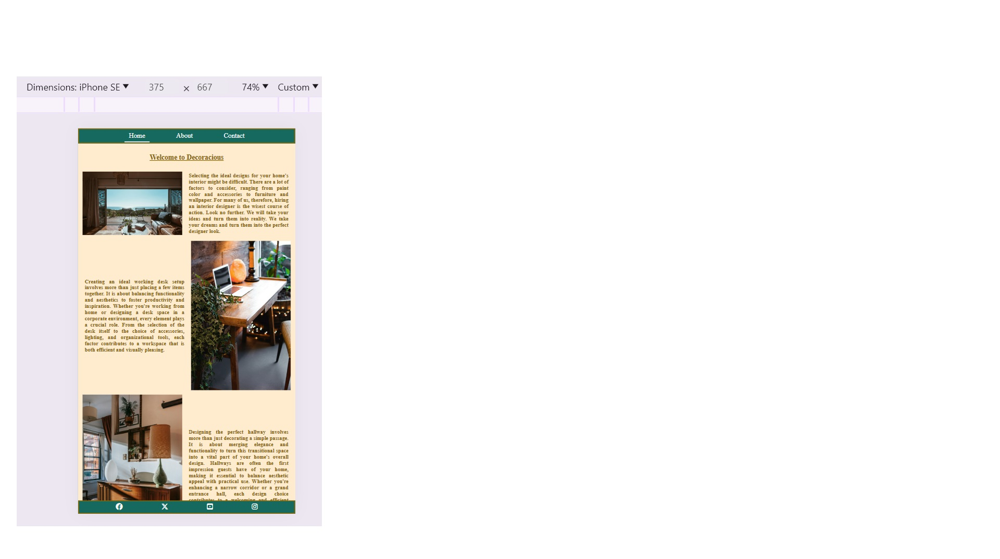
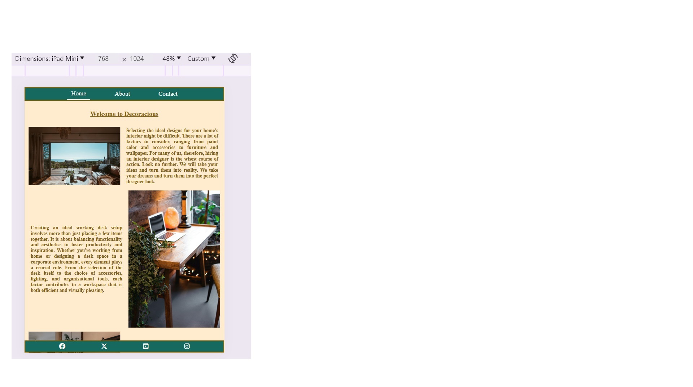
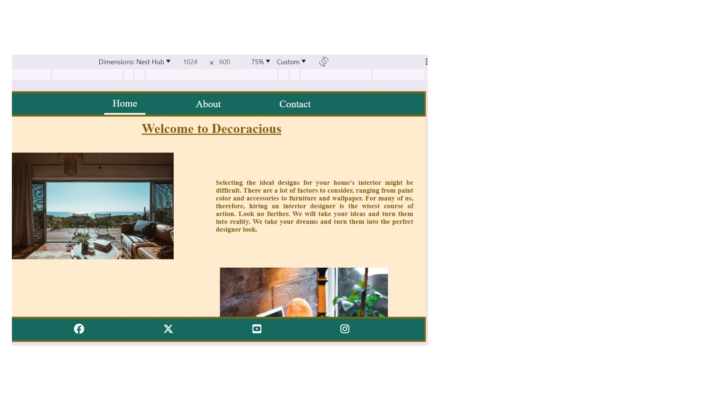
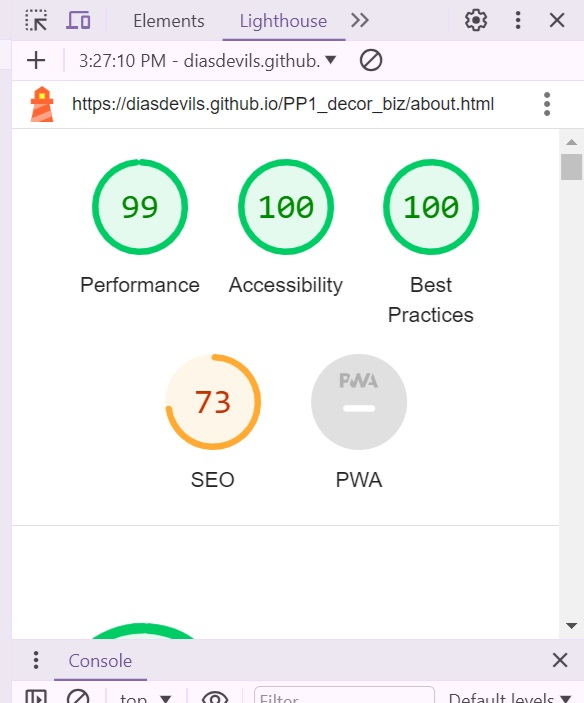
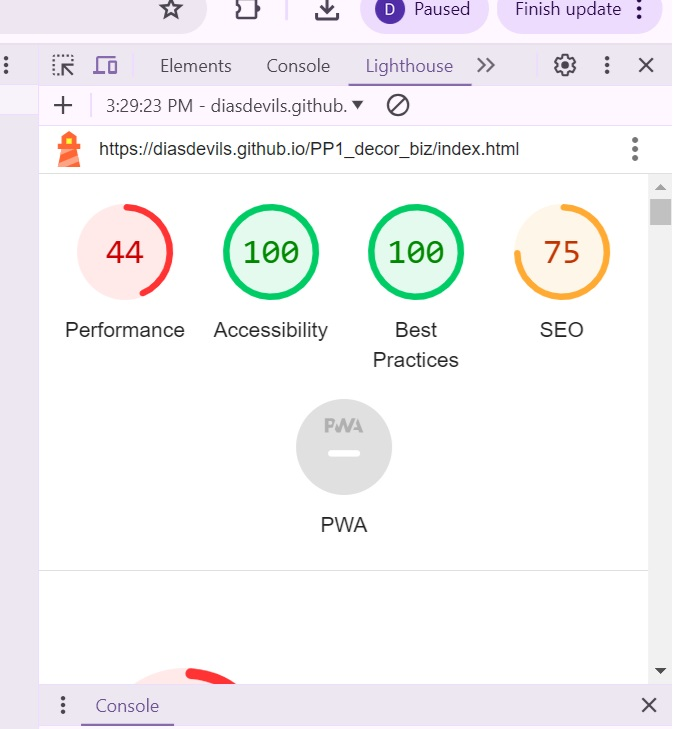
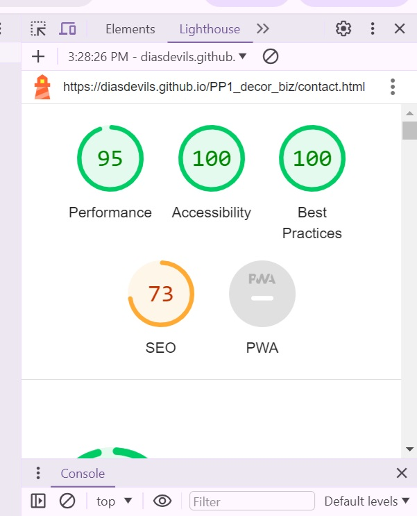

# PP1_decor_biz
# DECORATIOUS

The PP1 decor business named Decoracious is a website for a business which offers decoration/re-decoration in the home service.

Users will be able to see some of the examples of their work on the first "HOME" page. There are no prices because jobs vary therefore this is not a detail to be included in the website. The site is targeted so that people know of the business existence rather than to shop.

Photos of how the website looks on production Mobile size.

Photos of how the webiste looks on Ipad size.

Photos of how the website looks on website size.

#FEATURES

There are some features included in this site;
1- Navigational bar consisting of Home, About and Contact sections
This has a hover over function which reverse the colours so easy to see they are on or about to click on the sections and they also have an underline to show they are on the page.
2- Social media network links at the bottom footer with thier icons for all the three pages.
Both bars remain fixed during scrolling.

Overall the website is very easy to navigate. There are no hidden toggles and the user does not have to figure out where to scroll or what to click to learn where to go.

# TESTING 

I used the validators for both HTML and CSS.
Sadly I lost the screenshots to show all the validation errors I had in the about html section and the my scc stylesheet. But I fixed and rechecked html.

I have validated once more to show the validation in SCC and since I did not fix all the erros in css the validation shows the errors again.

And I have also tested for accessibility for all pages.

# BUGS
I had a lof of difficulties, especially with resizing for each device. I am aware that the website size home page does not look great in terms of size and could look better but I am not sure how to make it better for a more enjoyable viewer experience.
Also the social media links open on the same site, instead of in a different tab.

I had struggled understanding concepts and working things out to the point that I had tried two other projects prior to this one.
First I had tried applying the knowledge from the Love Running code
* from https://github.com/Code-Institute-Solutions/love-running-v3/
* for My music band project https://github.com/DiasDevils/Music_Band 
* and after i tried code from https://github.com/D0nni387/flex-demo 
* and applied to My Project https://diasdevils.github.io/Various_Business/

# REFERENCES AND CREDITS
I finally made this project taking code from all the cources named above and Chat GPT aid as well.
I used the following:
 * https://jigsaw.w3.org/css-validator/validator
* https://validator.w3.org/
* https://favicon.io/
* https://fontawesome.com/kits
Code credit to:
* https://github.com/Code-Institute-Solutions/love-running-v3/
* https://github.com/D0nni387/flex-demo 
* Chat GPT 

Photos from Pexel.com with credits for the photos going to Heyho, Andreaedavis, Charlotte May, Ben Mack, Falling4utah, Jonathan Borba, Ksenia Chernaya, Oktay Koseoglu, Orlov Maria, Skylar Kang.

